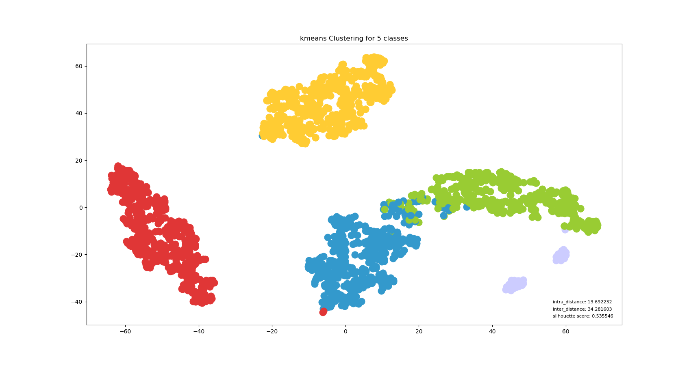

# data_analysis
data classification and clustering

## classification

### Usage
```python
pip install -r requirements.txt
python train.py -m resnet # multi-class classification using resnet
python train.py -m fcn    # multi-class classification using fcn
python random_forest.py   # binary classification using random forest
```

## clustering

### Dependencies
- argparse
- sklearn
- numpy
- matplotlib
- pandas
- functools

### Usage
```bash
python main.py --method kmeans           # using kmeans
python main.py --method kmeans++         # using kmeans++
python main.py --method hierarachical    # using hierarchical clustering
python main.py --method DBSCAN           # using DBSCAN
```
> Other avaliable arguments:
> --method: Clustering method. Choices: test_kmeans, test_kmeans++, except for four listed.
> --repeat: Repeat test for n times to validate robustness
> --eps: Only for DBSCAN, the maximum distance between two samples for one to be considered as in the neighborhood of the other.
> --min_samples: Only for DBSCAN, the number of samples (or total weight) in a neighborhood for a point to be considered as a core point.
> --n_clusters: Only for kmeans or hierarchical clustering, the numbers of clusters
> --init:Only for kmeans, method for init clusters'
> --reduction: method for dimension reduction. Choices: TSNE, MDS
> --random_state: random seed for dimension reduction
> --output_dir: Dir to output results
> --data_dir: Dir to load data


### Demo
```
python main.py --method kmeans++
```
txt file saved in `./clustering/output/kmeans_5.txt`.

visulization results saved in `./clustering/output/kmeans_5.png`




## References: 
[1] [Deep learning for time series classification: a review](https://arxiv.org/pdf/1809.04356.pdf)
[2] [k-means++: the advantages of careful seeding](https://www.researchgate.net/publication/220778887_K-Means_The_Advantages_of_Careful_Seeding)

